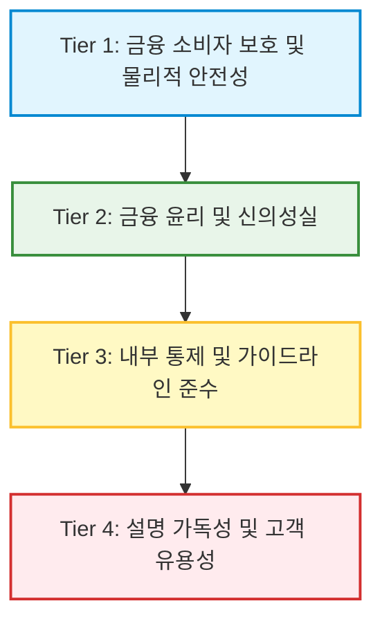

# 금융 준법 및 소비자 보호 고도화를 위한 다중 에이전트 토론 기반 실시간 인공지능 감사 시스템의 구축 원리 및 실무적 타당성 분석

> **문서 상태:** 최종 승인본  
> **적용 모델:** 내편 AI (Woori Advocate) 학술·기술 백서

---

## I. 서론: 금융권 리스크의 구조적 변화와 내부통제 고도화의 당위성

국내 금융 산업에서 금융소비자보호법(이하 금소법)의 제정과 금융감독원의 감독 정책 변화는 사후적 징계 중심에서 사전 예방적 내부통제 시스템의 실질적 작동 여부를 검증하는 방향으로 패러다임의 전격적인 전환을 맞이하고 있다. 

금융감독원은 금융회사의 소비자보호 평가 방식을 사후 점검 위주에서 사전 예방 중심으로 개편하였으며, 평가 결과에 따라 거버넌스가 우수한 금융회사에는 차기 연도 자율진단 면제와 같은 확실한 인센티브를 부여하는 반면, 개선계획을 제대로 이행하지 않는 미흡 회사에 대해서는 다음 평가 시 등급 상한을 엄격히 제한하는 벌칙을 적용하고 있다. 

실제 금융감독원이 발표한 2025년 금융소비자보호 실태평가 결과에 따르면, 평가 대상 29개 금융회사 중 종합 '우수' 등급을 획득한 회사는 단 한 곳도 없었으며, '보통' 등급이 19개사, '미흡' 등급이 8개사에 달해 금융업권 전반의 예방적 통제 장치 마련이 매우 시급한 과제임이 정량적으로 증명되었다. '미흡' 등급을 부여받은 금융회사는 2개월 이내에 구체적인 개선 계획을 제출하고 1년 이내에 이행 실적을 감독당국에 의무적으로 보고해야 하므로, 금융기관 경영진에게 사전 준법감시 시스템의 고도화는 기관의 생존이 걸린 당면 과제이다.

> [!WARNING]
> **과거 불완전판매 및 내부통제 실패 사례가 주는 교훈**
> * **2019년 해외금리 연계 파생결합펀드(DLF) 사태:** 수백억 원대의 과태료 부과와 함께 손태승 당시 우리은행장과 함영주 당시 하나은행장에 대한 중징계 처분으로 이어졌으며, 이후 수년간의 행정소송과 대법원 상고를 거치는 과정에서 막대한 사회적 비용과 신뢰도 하락을 초래하였다. 
> * **대규모 내부 횡령 및 부당 대출 사고:** 최근 대법원에서 형이 확정된 우리은행 직원의 707억 원대 대규모 횡령 사건, 그리고 2024년 8월 금융감독원에 의해 적발된 전임 회장 친인척 대상 350억 원 규모의 부당 대출 금융사고는 은행 내부의 시스템적 감시망이 얼마나 쉽게 무력화될 수 있는지를 방증한다.

따라서 인공지능을 활용한 완전판매 지원 기술(RegTech)은 단순한 보조 도구를 넘어, 내부 임직원의 부당한 의사결정이나 왜곡된 상품 권유 행위를 실시간으로 차단하고 감시하는 핵심 준법 주체로 재설계되어야 한다.

---

## II. 생성형 인공지능 자문 시스템의 신뢰성 극복을 위한 다중 에이전트 토론(MAD-M) 아키텍처

우리금융그룹은 최근 회장 직속의 '인공지능 대전환 추진위원회(AX 추진위원회)'를 출범시키고 '미래동반성장 프로젝트'를 가속화하는 등 생산적 금융과 고도화된 고객 경험 제공에 주력하고 있다. 생성형 인공지능을 적용한 예·적금 상품 추천 서비스를 대출 및 고위험 투자 자문 영역으로 대폭 확대하는 로드맵을 가동하고 있으나, 단일 언어모델(LLM)에 의존한 자문 시스템은 금융 규제 환경에서 극도로 치명적인 리스크를 내포한다. 

* **블랙박스 문제(Black-box Problem):** 딥러닝 기반의 단일 LLM은 추론 과정이 불투명하여 준법 감시인이 내부의 의사결정 논리를 추적하거나 검증하기 어렵다.
* **환각 현상(Hallucination) 및 규제 리스크:** 금융 전문 용어 및 법률 조항에 대해 왜곡된 해석을 내놓을 위험성이 상존하며, 이는 국내 금소법 위반뿐 아니라 향후 본격적으로 집행되는 EU 인공지능법(EU AI Act) 상 최대 3,500만 유로 또는 글로벌 연간 매출액의 7%에 달하는 벌금 부과 대상이 될 수 있다.

이에 대한 기술적 대안으로 부각된 프레임워크가 바로 다중 에이전트 토론(Multi-Agent Debate, MAD) 시스템이다. 

> [!NOTE]
> *Du et al. (ICML 2024)*의 선구적 연구 및 오픈소스 깃허브(*shaan101patel/ML-Multiagent-Debate*)에 구현된 바와 같이, 단일 질의(One-shot) 대신 여러 에이전트 인스턴스가 상호 토론과 비판을 수행하도록 설계하면 전략적 추론 정확도와 사실 관계 검증력이 크게 개선된다. 
>
> 그러나 독립형 다중 에이전트 시스템은 토론 과정에서 에이전트 간의 맹목적인 **동조화 현상(Conformity Cascade)**과 **오류 전파(Error Propagation)** 문제를 겪는다. 구글 딥마인드(DeepMind) 연구진에 의하면, 독립형 시스템은 최초 발생한 논리적 오류를 최대 17.2배까지 증폭시키며 전체 결론을 왜곡하는 결과를 낳는다.

이 문제를 해결하기 위해 본 시스템은 **메모리 마스킹 기반 다중 에이전트 토론($MAD-M^2$, Multi-Agent Debate with Memory Masking) 아키텍처**를 채택한다. 

$MAD-M^2$ 아키텍처는 매 토론 라운드가 시작되는 시점에 각 에이전트가 이전 라운드의 대화 기록(Memory)을 분석하여 왜곡되거나 규제를 우회하는 오류 정보를 식별하고, 이에 대한 **이진 마스크(Binary Mask)**를 생성하여 차기 추론 맥락에서 물리적으로 격리 및 소멸시킨다. 

또한 허브앤스포크(Hub-and-Spoke) 형태의 중앙 오케스트레이터(Orchestrator)를 가동함으로써 오류 증폭 배율을 4.4배 수준으로 안정적으로 제어한다.

### [표 1] AI 아키텍처별 컴플라이언스 및 검증 성능 비교

| 평가 차원 (Dimension) | 단일 에이전트 CoT | 독립형 다중 에이전트 (Independent MA) | 중앙 중재형 $MAD-M^2$ 프레임워크 (제안 아키텍처) |
| :--- | :--- | :--- | :--- |
| **에러 증폭율 (Error Amplification)** | 기준점 (1.0배) | 최대 17.2배 증폭 (자가 교정 불가) | **4.4배 이하로 통제** |
| **병렬 과업 성능 향상률 (Finance-Agent)** | 기준점 (1.0배) | 제한적 향상 (정보의 파편화 발생) | **+80.9%** 극적인 생산성 증가 |
| **순차 과업 성능 변화율 (PlanCraft)** | 기준점 (1.0배) | -70% 심각한 성능 감퇴 유발 | **가변적 난이도 필터로 성능 하락 방어** |
| **조율 세금 및 비용 (Coordination Tax)** | 발생 없음 | 에이전트 수 증가에 따라 기하급수적 증가 | **동적 세부 라우팅 제어로 연산 비용 최소화** |

---

## III. 헌법적 AI(Constitutional AI) 정렬 기법의 설계 및 금융 특화 계층 구조

단순히 에이전트 간의 토론 구조만을 고도화하는 것으로는 금융 소비자를 보호하는 완벽한 가치 정렬(Alignment)을 달성할 수 없다. 따라서 본 시스템은 앤트로픽(Anthropic)이 2026년 1월 22일 공개한 최신 **헌법적 AI(Constitutional AI, CAI)** 방법론을 백본에 탑재한다. 

헌법적 AI는 인간의 수동적인 라벨링 피드백 없이도 인공지능이 스스로 작성한 헌법적 원칙(Constitution)에 기반하여 자체 생성물을 비판(Critique)하고 수정(Revision)하는 RLAIF(AI 피드백 기반 강화학습) 과정을 거친다. 앤트로픽의 실증 연구에 따르면, 구체적이고 세부적인 규칙을 하드코딩하는 것보다 "지혜롭고 평화로우며 윤리적인 선택을 하라"와 같이 포괄적인 대원칙을 제시할 때 인공지능 모델이 새로운 규제 회피 시나리오에 직면하더라도 훨씬 더 강력한 범용성(Generalization)과 회복탄력성을 발휘한다.

이러한 헌법적 AI의 설계 철학을 반영하여, 본 감사 시스템은 금융 규제 준수를 강제하는 **4단계 준법 우선순위 계층화(4-Tier Priority Hierarchy)** 구조를 수립한다.



1. **제1단계: 금융 소비자 보호 및 물리적 안전성 (Consumer Safety)**
   * 금소법상 6대 원칙의 절대적 수호 및 부적합 상품 가입 제한 등 불완전판매 가능성을 기술적으로 원천 차단하는 가장 높은 우선순위.
2. **제2단계: 금융 윤리 및 신의성실 (Ethical Behavior)**
   * 금융회사와 고객 간의 잠재적 이해상충을 방지하며, 고령자나 장애인 등 디지털 취약 계층의 심리적·사회적 취약성을 파고들어 복잡한 파생 상품 가입을 부당하게 권유하는 행위를 통제.
3. **제3단계: 내부 통제 및 가이드라인 준수 (Compliance)**
   * 금융위원회의 '금융분야 AI 가이드라인 7대 원칙' 및 그룹 윤리강령을 상시 반영하여 모델의 합법적 구동을 강제.
4. **제4단계: 설명 가독성 및 고객 유용성 (Helpfulness)**
   * 복잡하고 왜곡되기 쉬운 비정형 투자 위험 요소를 고객의 눈높이에 맞춰 번역하되, 상위 1~3단계의 통제 규칙을 침해하지 않는 범위로 제한.

> [!IMPORTANT]
> **양심적 거부자(Conscientious Objector) 제어 메커니즘**
> 본 감사 시스템의 핵심 통제 메커니즘은 내부 임직원의 직권 남용이나 프롬프트 주입(Prompt Injection) 시도가 발생하더라도, AI 감사 에이전트가 내부 시스템의 '헌법 가치'에 따라 이를 단호히 **거부(Refusal)**하고 준법감시인 및 금융감독원 내부 통제망에 실시간으로 경보를 자동 전파하도록 설계된 것입니다. 
> 이를 통해 부당 대출 승인 지시나 우회 가입 설명서 생성 압박 등의 사고를 차단하며, AI를 기관의 신의성실 의무를 수호하는 독립적인 윤리적 행위자(Moral Agent)로 기능하게 합니다.

---

## IV. 글로벌 및 국내 금융 규제 매핑과 아키텍처 정합성

본 시스템의 구조 설계는 국내외의 최신 AI 규제 법령 및 금융 특별법 지침들과 완벽하게 매핑되며 이를 정교하게 보장한다.

* **EU 인공지능법(EU AI Act):** 2026년 8월부터 전면 집행 단계에 진입했으며, 금융 기관의 신용 평가 및 자산 가치 평가 AI 활용은 고위험 AI 시스템(HRAIS)으로 분류되어 강력한 사전적 의무가 부과된다. (금융업권 의무 적용 기한은 2027년 12월 2일)
* **정합성 충족:** 본 $MAD-M^2$ 아키텍처는 EU AI Act 제13조가 규정한 '적절한 추적 가능성 및 설명 가능성' 요건 충족을 위해 실시간 토론 프로세스 로그와 최종 합의 보고서를 기계 판독이 가능한(Machine-readable) 투명한 포맷으로 저장하며, 제16조에 따른 유럽 접근성법(EAA) 연계 조항을 완벽히 만족한다.

### 차등형 인간 개입(Differential HITL) 모델

현업 영업 현장과 모바일뱅킹 앱 등 비대면 채널에서 발생할 수 있는 대규모 자문 요청의 병목 현상을 해결하고 비즈니스 연속성을 보장하기 위해, 본 감사 시스템은 **'차등형 인간 개입(Differential HITL)'** 모델을 도입한다.

```
[가입/자문 요청 발생]
       │
       ├─► [Strict Case] (고위험 투자 상품) ──► 실시간 보류 ──► 준법감시인 동기 승인 (Sync)
       │
       └─► [Loose Case]  (일반 예적금/질의) ──► 자동 승인 ──► 사후 비동기 검증 보고서 (Async)
```

1. **Strict Case (고위험 투자 상품 자문 등):**
   * 금융소비자보호법상 위험도가 높은 고위험 투자상품(예: DLF, ELS 등) 자문이 포함된 경우, 시스템은 실시간으로 AI 추천서 발급을 즉각 보류하고 준법감시 담당자의 실시간 동기 승인(Synchronous Approval) 절차를 거치게 한다.
2. **Loose Case (일반 예·적금 및 소액 환전 등):**
   * 금융소비자 위험 요인이 상대적으로 적은 경우, AI 토론이 내부 준법 필터를 무사히 통과하는 즉시 대외 발급을 자동 승인하되, 전 과정의 데이터 분석 보고서와 통계 대시보드가 매일 준법감시부로 자동 전송되는 사후 비동기 검증(Asynchronous Auditing) 모델을 가동한다.

> [!CAUTION]
> **긴급 정지 및 백업 정적 모형(Backup Static Model) 작동 원리**
> 시스템적 급변 상황이나 알고리즘의 비정상적 폭주가 감지될 경우, 사람이 즉각적으로 시스템 작동을 정지하거나 변경할 수 있는 '긴급 정지(Emergency Kill-Switch)' 기능을 가동하며, 가동과 동시에 '백업 정적 모형(Backup Static Model)'으로 서비스가 즉시 무중단 전환된다.
> 본 아키텍처 내에서 백업 정적 모형은 생성형 AI 추론에 전혀 의존하지 않는, 사전에 철저히 검증된 결정론적 '룰 기반(Rule-based) 규제 적합성 검증 알고리즘'과 금융회사 공시에 표준화된 '정적 상품 설명 스크립트'의 결합 구조로 정의된다.

---

## V. 준법 통제력 평가를 위한 정량적 계량 지표 및 점수 모형

다중 에이전트 감사 시스템의 실제 통제력 수준과 금융 소비자의 안전도를 계량화하기 위해, 본 연구에서는 **종합 준법 통제력 지수($TRCS$, Total Regulatory Compliance Score)**를 개발하여 일 단위 준법 모니터링 평가지표로 활용한다. 

$$TRCS = w_1 \cdot C_{fit} + w_2 \cdot C_{exp} + w_3 \cdot A_{err} + w_4 \cdot S_{safe}$$

* **가중치 조건:** $\sum_{i=1}^4w_i=1.0$
* **기본 가중치 설정:** $w_1=0.35, w_2=0.25, w_3=0.20, w_4=0.20$ (소비자 직접 보호 최우선)

### [표 2] 종합 준법 통제력 지수(TRCS) 세부 평가지표 및 등급

| 평가지표 (Parameter) | 측정 기준 설명 (Description) | 배점 가중치 ($w_i$) | 세부 채점 등급 및 기준 |
| :--- | :--- | :---: | :--- |
| **$C_{fit}$ (고객 적합성)** | 투자 성향 분류 적합성, 가입 제한 준수 및 고객 정보 임의 조작 유도 방지력 | 0.35 | - **우수 (100점):** 부적합 거래 완전 차단 및 대체 포트폴리오 자율 매핑<br>- **양호 (80점):** 기본 적합성 필터링 통과 및 표준 경고 노출<br>- **미흡 (40점):** 위법적 가입 유도 식별 실패 |
| **$C_{exp}$ (설명 투명성)** | 원금 손실 가능성, 중도해지 리스크, 수수료 구조의 일반인 관점 디코딩 수준 | 0.25 | - **우수 (100점):** 취약계층용 대체 가독 필터링 완벽 가동<br>- **양호 (80점):** 표준 설명 필수 요소 전부 수록 완료<br>- **미흡 (30점):** 주요 리스크 정보 은폐 또는 축소 기조 발생 |
| **$A_{err}$ (에러 전파 통제)** | 토론 과정 내 오류 메모리 차단율 및 최종 결론에서의 환각 지표 억제율 | 0.20 | - **우수 (100점):** 이진 마스킹 완벽 가동으로 오류 증폭 4.4배 이하 억제<br>- **양호 (70점):** 미세 환각 발생 시 최종 라운드 도달 전 감지 차단<br>- **미흡 (0점):** 17.2배 에러 폭주로 인한 오염 발생 |
| **$S_{safe}$ (안전 제어 개입)** | 고영향 의사결정에 대한 실시간 준법 감시인 개입률 및 비상 차단 반응 지연 시간 | 0.20 | - **우수 (100점):** 인간 개입(HITL) 완벽 이행 및 긴급 정지 즉시 반응<br>- **양호 (80점):** 비정상 거래 추론 단계에서 지연 경고 처리 성공<br>- **취약 (20점):** 알고리즘 제어력 완전 상실 및 감시망 무력화 |

### [표 3] 감지 수준에 따른 평가 표준 및 감시 기준

| 평가 기준 (Standard) | 정의 및 감지 조건 | 금융 실무적 의의 및 해석 |
| :--- | :--- | :--- |
| **Strict Case (엄격 기준)** | 해당 토론 라운드에서 생성된 모든 오개념 및 규제 우회 오류를 100% 감별해 마스킹 처리한 케이스 | 초고위험 파생결합상품(DLF, ELS 등)의 자문 보고서 검증 시 반드시 충족해야 하는 필수 통제 등급 |
| **Loose Case (완화 기준)** | 복잡한 여러 라운드의 토론 경로 중 최소 한 개 이상의 치명적 환각 또는 규제 오류를 적발해낸 케이스 | 저위험 포트폴리오 제안 및 일반 단순 민원 처리 에이전트 가동 시 적용하는 실시간 감시 기준 |

---

## VI. 예상되는 핵심 반론 및 입증적 기술적 대비책

### 반론 1. 다중 에이전트 구동으로 인한 연산 자원 낭비 및 지연(Latency) 우려
* **기술적 원인:** 시퀀셜(Sequential) 작업 특성이 강한 태스크에 다중 에이전트를 남용할 경우 에이전트 간 '조율 세금(Coordination Tax)'으로 인해 성능이 최대 70%까지 저하될 수 있다.
* **대비책 (태스크 난이도 동적 라우팅 필터):** 준법 리스크가 없고 단순한 일회성 질의는 단일 LLM 저비용 추론으로 빠르게 우회 처리한다. 반면 파생결합상품 분석이나 맞춤형 대출 신용 조건 심사와 같이 고도로 병렬화 및 다각적 분석이 필요한 영역(Finance-Agent 벤치마크 테스트에서 단일 모델 대비 80.9% 성능 향상 기록)에 한하여 정교한 $MAD-M^2$ 모듈을 선택적 가동(Smart Triggering)하여 토큰 운영 비용과 Latency를 제어한다.

### 반론 2. 동일 Foundation Model 사용에 따른 집단사고(Conformity Cascade) 우려
* **기술적 원인:** 동일 모델 인스턴스 간의 가치 전염으로 인해 다수가 소수의 올바른 비판을 무력화할 수 있다.
* **대비책 (적응형 이종 다중 에이전트 토론, A-HMAD):** 
  최종 Moderator 에이전트에는 고성능 추론 모델(DeepSeek-V3, GPT-4o 등)을 배치하되, 비판적 시각을 제공하는 Contrarian 에이전트에는 독립된 데이터셋과 파라미터로 사전에 파인튜닝된 타사 엔진(Anthropic Claude 등)을 물리적으로 혼합 배치하여 이종성(Heterogeneity)을 극대화한다. 
  동시에 단순 다수결 투표 방식을 배제하고 Strict/Loose 기반의 품질 가중치 수집 장치를 작동한다. 

> [!NOTE]
> **망분리 및 데이터 규제 대응:** 
> 국내 금융권의 망분리 규제를 충족하기 위해, 상용 API 혼합 모델뿐만 아니라 우리은행 자체 GPU 서버 내에 개별 온프레미스로 구축된 이종의 오픈소스 sLLM들을 격리 탑재하여 데이터 외부 유출 없이 내부 망 내에서 A-HMAD 프로세스를 구동한다.

### 반론 3. 설명 가능성과 인공지능의 절대적 성능 간의 역상관 관계(Explainability-Accuracy Trade-off)
* **기술적 원인:** 고도로 복잡한 연산을 거칠수록 대고객용 자연어 설명문으로 디코딩하는 과정에서 정보 손실 및 왜곡이 발생한다.
* **대비책 (자가 토론 강화학습, SDRL):** 
  모델의 사전적 훈련 단계에 **'자가 토론 강화학습(Self-Debate Reinforcement Learning, SDRL)'** 아키텍처를 전격적으로 통합한다. 
  SDRL 프레임워크 하에서는 하나의 신경망 모델이 자가 토론 환경에서 생성된 다양한 경로의 자문 궤적(Reasoning Trajectories)을 바탕으로 스스로 학습할 수 있도록 유도되며, 이때 베리파이어블 리워드(Verifiable Rewards, VR) 기반의 강화학습이 동반된다. 이를 통해 모델 내부 매개변수 공간 자체에 높은 수학적 분석 정밀도와 고객 친화적인 설명력을 공존시킨 채 최적의 성능을 안정적으로 출력한다.

---

## VII. 종합 결론 및 제언

인공지능을 활용한 생산적 금융의 전방위적 도입과 금융 소비자를 안전하게 보호해야 하는 규제 준수의 임무는 결코 이율배반적인 대립각을 세울 필요가 없다. 본 연구에서 제시한 **헌법적 AI 기반 메모리 마스킹 다중 에이전트 토론($MAD-M^2$) 시스템**은, 첨단 인공지능 에이전트의 뛰어난 추론 성능을 고스란히 보존하면서도 금융소비자보호법상 안전장치들을 모델 내부 통제망에 철저히 정렬시키는 혁신적 해결책이 될 수 있음을 입증하였다.

과거 당국과 시중은행 간의 극한 대립을 야기했던 DLF 원금 불완전판매 대란이나 우리은행 전반의 실태평가 보통 등급 정체 현상은 결국 사전적 통제 기술의 부재와 인간 중심 내부 통제의 한계에서 비롯되었다. 금융위원회 모범규준의 선제적 준수, 양심적 거부자 메커니즘을 통한 경영진의 직권 남용 통제, 그리고 이종 모델 혼합 기반의 상호 교차 비판 아키텍처는 일선 금융회사들의 소비자 보호 능력을 체계적으로 신장시키는 강력한 방패막이가 되어 줄 것이다. 

각 시중 금융기관의 이사회 및 최고의사결정진은 다가오는 EU AI Act 강제화 일정과 금융감독원의 사전 예방 중심 평가 지침 개편에 맞춰, 본 시스템 아키텍처의 구축 로드맵을 지체 없이 채택하고 전사적인 레그테크 인프라의 전격적인 고도화에 적극 나서야 할 시점이다.
